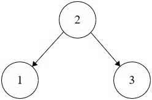
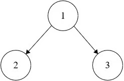

Problem:
Valid Binary Search Tree

Given the root of a binary tree, return true if it is a valid binary search tree, otherwise return false.

A valid binary search tree satisfies the following constraints:

The left subtree of every node contains only nodes with keys less than the node's key.
The right subtree of every node contains only nodes with keys greater than the node's key.
Both the left and right subtrees are also binary search trees.
Example 1:

Input: root = [2,1,3]

Output: true
Example 2:

Input: root = [1,2,3]

Output: false

Problem:
We recursively traverse the tree while ensuring each node's value stays within a strictly defined minimum and maximum range inherited and updated from its ancestors.
